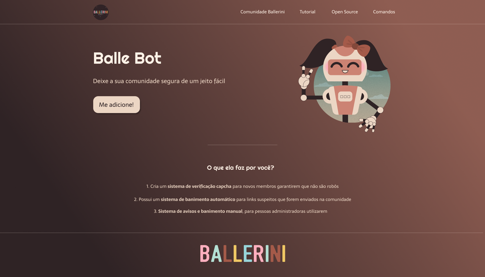

 

# Balle Bot 🤖💜

 

## Descrição do Projeto 📃

 🤖 Esta é uma lading page, a qual teve seu design desktop criado pela <a href="https://www.youtube.com/watch?v=llF6vD-RljE&t=1s&ab_channel=RafaellaBallerini">Rafaella Ballerini</a>, e que seu intuito principal é apresentar a Balle Bot, um bot presente no Discord que organiza e ajuda a manter a comunidade 🤖

 

## Status do Projeto 💻
<h4 style="text-align: center"> 🚧✅ Completo 🚧✅ </h4>

 

## Tecnologias 👩‍💻
- [JavaScript](https://developer.mozilla.org/pt-BR/docs/Web/JavaScript) 
- [HTML5](https://developer.mozilla.org/en-US/docs/Glossary/HTML5)
- [CSS3](https://developer.mozilla.org/pt-BR/docs/Web/CSS)

 

## Desenvolvedora 💻
 <a href="https://www.linkedin.com/in/raphaela-guiland-ferraz-32a980214">
  
  <b>  Raphaela Guiland Ferraz</b>
 </a>

  
  

 
Feito com carinho por Raphaela Ferraz ❤🎮
